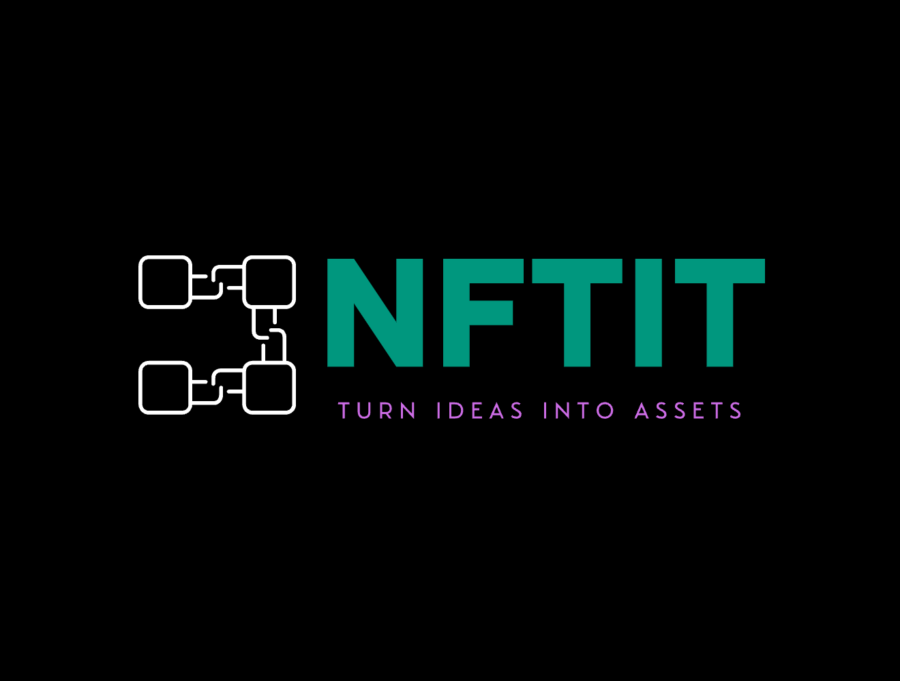

# NFTiT - Create, Mint, Own



## Abstract

NFTiT is a decentralized application (dApp) that enables users to create, mint, and own NFTs (Non-Fungible Tokens) on the blockchain. This platform provides a seamless experience for artists, creators, and collectors to participate in the NFT ecosystem.

## Introduction

NFTiT is designed to democratize the NFT creation and ownership process. Our platform offers:

- User-friendly interface for NFT creation
- Secure minting process
- Transparent ownership tracking
- Marketplace integration
- Smart contract-based security

## Architecture

The project follows a modern web3 architecture:

### Frontend

- React.js for the user interface
- Web3.js for blockchain interactions
- Material-UI for component styling
- Redux for state management

### Backend

- Smart Contracts (Solidity)
- IPFS for decentralized storage
- Ethereum blockchain network

## Tools & Technologies

### Frontend

- React.js
- Web3.js
- Material-UI
- Redux
- Ethers.js

### Backend

- Solidity
- Hardhat
- IPFS
- OpenZeppelin Contracts

### Development Tools

- Node.js
- npm/yarn
- Git
- MetaMask

## Setup Instructions

1. Clone the repository

```bash
git clone [repository-url]
cd NFTiT-Create,Mint,Own
```

2. Install dependencies

```bash
# Install root dependencies
npm install

# Install client dependencies
cd client
npm install
```

3. Configure environment variables

```bash
# Create .env file in the root directory
cp .env.example .env
# Add your environment variables
```

4. Start the development server

```bash
# Start the client
cd client
npm start
```

5. Connect MetaMask

- Install MetaMask browser extension
- Connect to the appropriate network
- Import or create a wallet

## Smart Contract Deployment

1. Compile contracts

```bash
npx hardhat compile
```

2. Deploy contracts

```bash
npx hardhat run scripts/deploy.js --network [network-name]
```

## Contributing

We welcome contributions! Please follow these steps:

1. Fork the repository
2. Create a feature branch
3. Commit your changes
4. Push to the branch
5. Create a Pull Request

## License

This project is licensed under the MIT License - see the [LICENSE](LICENSE) file for details.

## Contact

For any queries or support, please reach out to us at:

[Sahil Gurnani](sahilgurnani20@gmail.com),
[Prayag Tandon](prayagtandon2010@gmail.com)

## References

### Technical Resources

1. [Ethereum Documentation](https://ethereum.org/en/developers/docs/) - Official Ethereum development documentation
2. [OpenZeppelin Contracts](https://docs.openzeppelin.com/contracts) - Secure smart contract development library
3. [IPFS Documentation](https://docs.ipfs.tech/) - InterPlanetary File System documentation
4. [React Documentation](https://reactjs.org/docs/getting-started.html) - React.js official documentation
5. [Web3.js Documentation](https://web3js.readthedocs.io/) - Ethereum JavaScript API

### NFT & Blockchain

1. [NFT Standards (ERC-721, ERC-1155)](https://eips.ethereum.org/EIPS/eip-721) - Ethereum NFT token standards
2. [Polygon Documentation](https://docs.polygon.technology/) - Polygon network documentation
3. [MetaMask Documentation](https://docs.metamask.io/) - MetaMask wallet integration guide

### Business & Market

1. [NFT Market Statistics](https://www.statista.com/statistics/1255816/nft-market-size/) - NFT market size and trends
2. [NFT Trading Platforms](https://opensea.io/) - OpenSea NFT marketplace
3. [NFT Business Models](https://www.forbes.com/sites/forbestechcouncil/2021/03/25/the-business-of-nfts-how-companies-are-using-non-fungible-tokens/) - Forbes article on NFT business applications

### Development Tools

1. [Hardhat Documentation](https://hardhat.org/getting-started/) - Ethereum development environment
2. [Pinata IPFS API](https://docs.pinata.cloud/) - IPFS pinning service documentation
3. [Material-UI Documentation](https://mui.com/getting-started/usage/) - React UI component library

## Acknowledgments

- OpenZeppelin for smart contract templates
- The Ethereum community
- All contributors and supporters of the project
